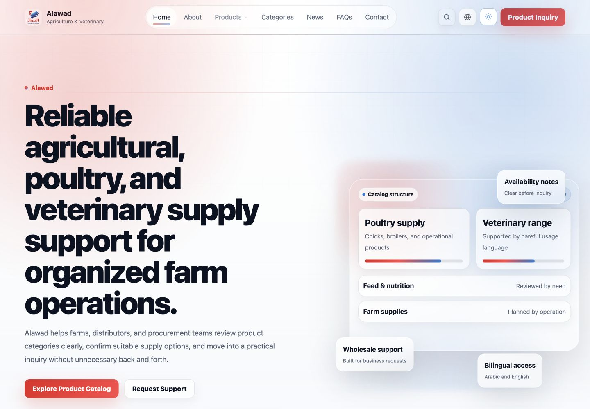
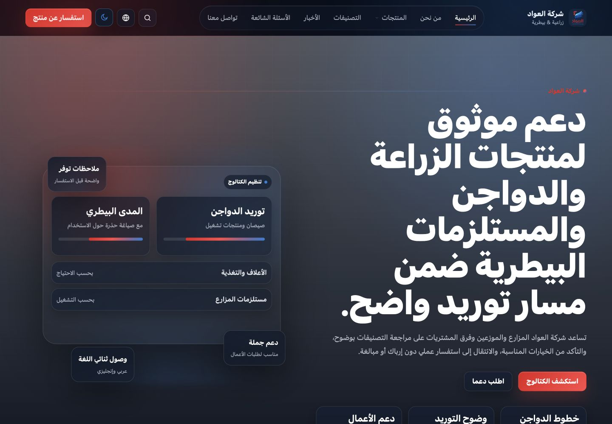
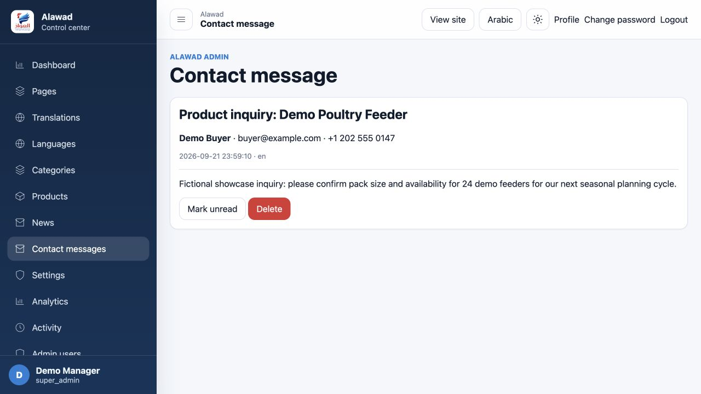
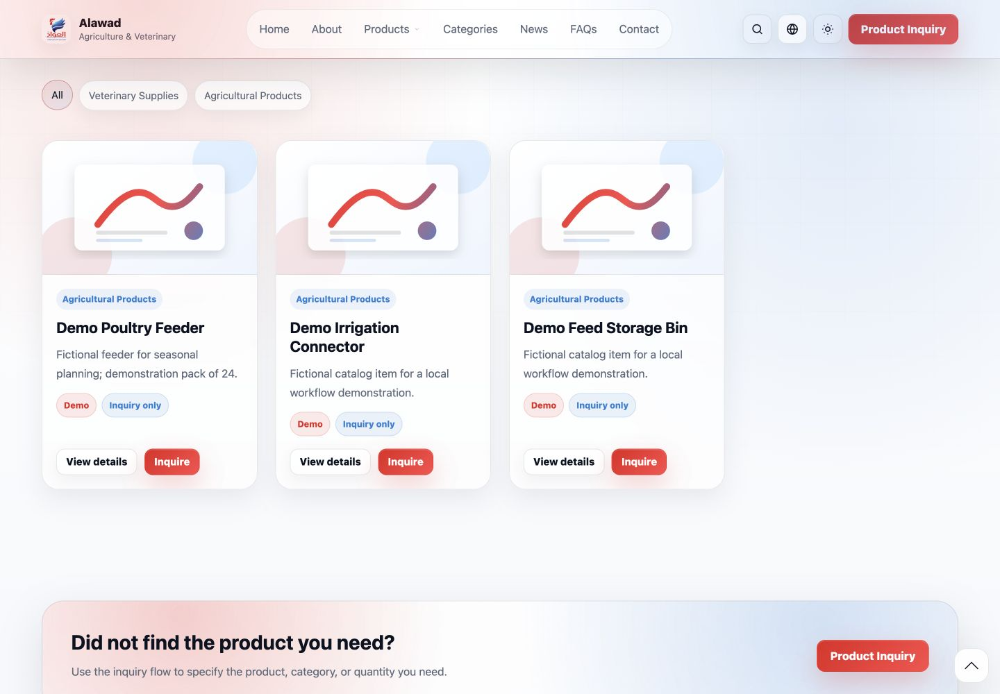
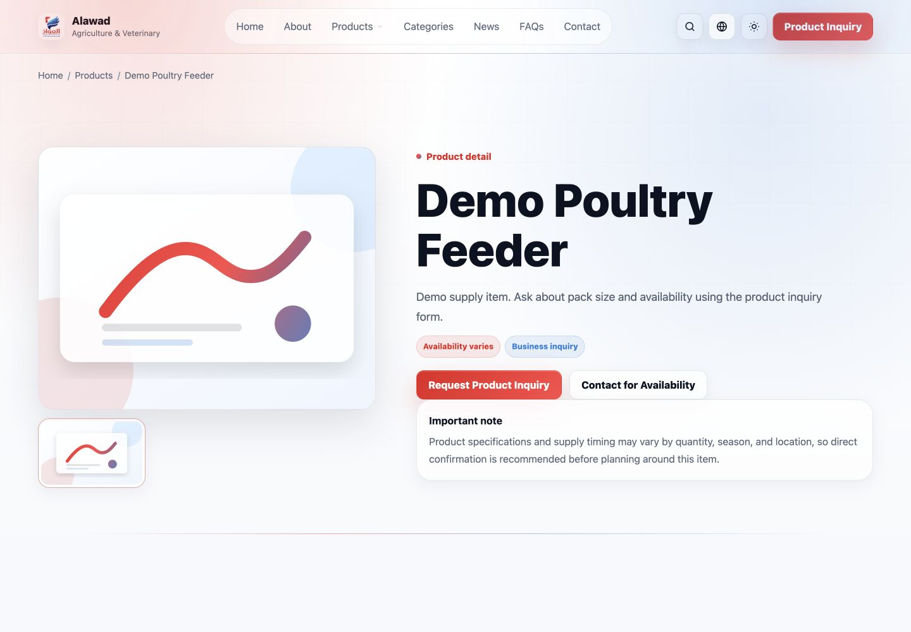
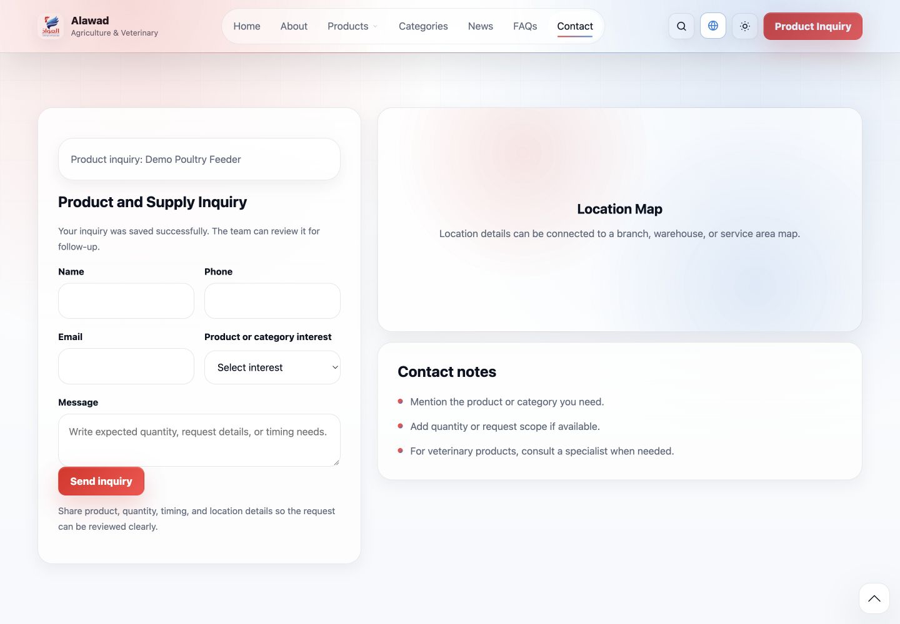
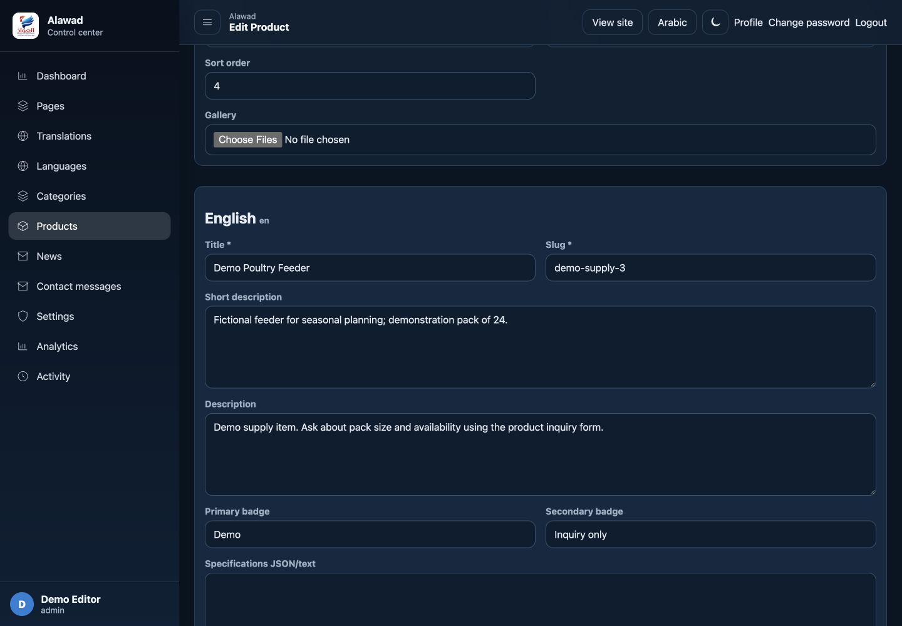

# Alawad

A bilingual agricultural, poultry and veterinary supply catalog with product-context inquiries and administration.

This is a documentation and visual showcase. The application source code is not included. Technical descriptions and earlier test results come from the prepared project documentation; those application tests were not repeated for this export.

**Portfolio:** [English](https://ideabat.com/portfolio/alawad-agriculture-supply-platform/) · [Türkçe](https://ideabat.com/tr/portfolio/alawad-agriculture-supply-platform/) · [العربية](https://ideabat.com/ar/portfolio/alawad-agriculture-supply-platform/)

**Case study:** [English](https://ideabat.com/case-study/alawad-catalog-inquiry-management/) · [Türkçe](https://ideabat.com/tr/case-study/alawad-catalog-inquiry-management/) · [العربية](https://ideabat.com/ar/case-study/alawad-catalog-inquiry-management/)

## Ragıp Mullamusa’s contribution

I built Alawad’s public catalog and administration through Ideabat: PHP/PDO data flows, localized relational content, category and product presentation, inquiry persistence, read-state handling and role checks for account management. This is supply-catalog software; no ownership of the supply business or Ideabat-owned SaaS offering is asserted.

## At a glance

| Area | Delivered scope |
|---|---|
| Visitor journey | Category → product detail → product-specific inquiry |
| Administration | Content editing and saved inquiry review |
| Stack | PHP, PDO, MySQL/MariaDB, HTML/CSS and JavaScript |
| Languages | English LTR and Arabic RTL |
| Presentation | Responsive web with built-in light/dark controls |
| Commerce boundary | Inquiry-led catalog, not checkout or fulfillment |

## Preserve the product context

An inquiry action starts on a specific product. Carrying that identity into the contact form lets the stored request explain what the buyer was looking at. The administrator can review that context without inferring it from a free-form greeting. Opening the message changes its read state; it does not claim the request was answered or an order completed.

## Content visibility is part of the catalog model

Shared product and category records carry identity and publication settings; related language rows carry the translated title, slug and description. The public catalog reads the same records maintained by administration. Category ancestry matters because a child belongs within a published, translated category path. The documentation distinguishes that inspected rule from the smaller set of demonstrated browser journeys.

How shared content, localized pages and a persisted inquiry workflow connect Alawad’s public site and administration.

## Context and objective

Alawad presents agricultural, poultry and veterinary supply products. The implemented workflow supports a practical requirement: a visitor should be able to identify a product and send a request that retains that context for review. This requirement is visible in the application; no client interview or measured baseline is claimed.

The resulting scope joins a public catalog with content and inquiry administration. Visitors browse, inspect and inquire. Administrators maintain the content and read saved requests; super administrators additionally manage accounts.

## Discovery to request

 A product detail gives the visitor a specific next step rather than relying only on general contact information. 

The inquiry link carries the product slug to the contact form. The server validates the request and resolves the product before storing a product-specific subject and message in the inquiry store. A redirect renders the saved confirmation. 

The adjacent map area is an unconnected placeholder, not a verified map service.

## Administrative review

 Opening the saved message in administration shows its product context and changes the read state. A fictional Demo Buyer request was submitted in the browser, then independently checked in the local database after review. That establishes the persistence/read transition for this scenario; it does not establish response times or completed orders.

## Content architecture

The application is a PHP monolith with separate public/admin entry points and shared PDO access. Products, categories, pages and news have shared entity records and language-specific rows. Admin content saving uses a database transaction, while the public catalog reads the corresponding localized data. 

A saved English product description was verified in the database and then on its public card. Category eligibility also checks ancestors in source, so inactive or untranslated parent categories affect descendant visibility. This edge-case rule was code-reviewed, not exhaustively tested.

## Localization and presentation decisions

English LTR and Arabic RTL are implemented for both interfaces, with their own theme controls. The public site was tested at desktop and mobile browser widths. Content language, interface language and marketing language remain separate: these case-study translations do not add Turkish support to the app.

## Integration scope

The demonstrated path uses local PHP/PDO persistence. Payment, fulfillment and CRM integration are not claimed. The map area visible in the capture is a placeholder.

## Delivered capability

The verified result is a connected software path: product context reaches a saved inquiry, administrators can review it, and catalog edits reach the public page. No customer metric, testimonial, launch date or business outcome is supplied. Screenshots use fictional data and real application rendering.

Developed by Ragıp Mullamusa at Ideabat. [Discuss a similar workflow with Ideabat](https://ideabat.com).

## Screen walkthrough

These real application captures come from the project’s prepared publication material. Demonstration records are synthetic; a screen illustrates the interface, not a production deployment or a permission test.

### 01 — Alawad English homepage with product catalog and inquiry actions.

### 02 — Arabic right-to-left homepage using the built-in dark theme.

### 03 — Administrator reads the saved fictional product inquiry from Demo Buyer.

### 04 — Three fictional supply products with details and inquiry buttons.

### 05 — Fictional poultry feeder detail page with a product inquiry action.

### 06 — Public form confirms that the fictional product inquiry was saved. The adjacent map is an unconnected placeholder.

### 07 — Product editor showing the saved English description for a fictional feeder.

## Evidence and availability

Implementation and historical validation descriptions above are supported by the project’s prepared documentation. The application tests were not rerun for this documentation export. The screenshots demonstrate the captured version, not current service availability, customer adoption or measured commercial outcomes.

## Ownership and technical review

This repository contains documentation and approved visual material, not an application source release. Presentation through Ideabat does not transfer a client’s ownership. For employment, collaboration or technical-review inquiries, contact Ragıp Mullamusa through Ideabat. Access to client-owned source requires prior permission from the project owner and compliance with applicable confidentiality requirements. Requests are reviewed individually; source access is not guaranteed. No software license or redistribution permission is granted by this showcase.

## Contact

Ragıp Mullamusa is the founder of [Ideabat](https://ideabat.com/). For relevant engineering, employment or collaboration inquiries, use [the contact page](https://ideabat.com/contact-us/) or [info@ideabat.com](mailto:info@ideabat.com).
